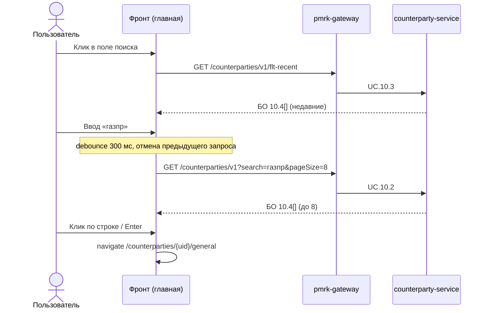
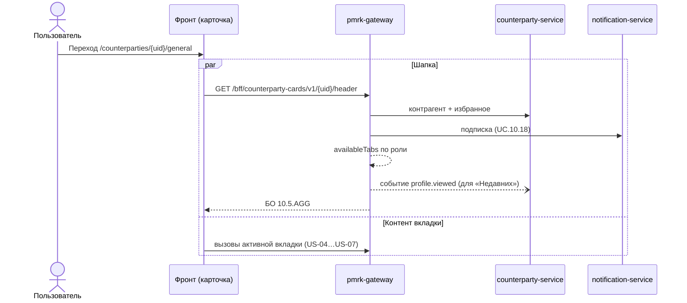
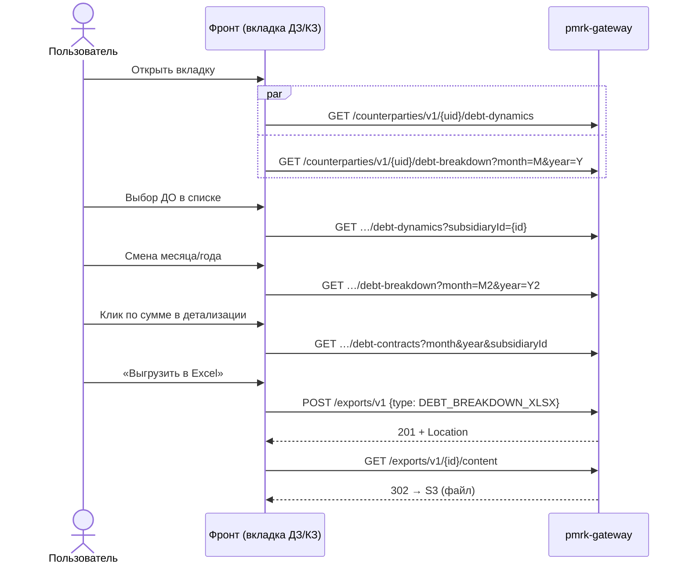

# ПМРК — пользовательские истории: главная, поиск, карточка контрагента

Охват: главная страница, поиск контрагента, шапка карточки и вкладки «Общие сведения», «Аффилированность», «Данные по ДЗ и КЗ», «Кредитный лимит».

Источники: постановки репозитория [dreamw0rk/pmrk-design](https://github.com/dreamw0rk/pmrk-design) — `Архитектура/Постановки/10, 19, 21, 22, 27, 29-32, 33, 60, 99`, `Архитектура/07_Сквозные_механизмы.md`, `Архитектура/04_Реестр_API.md`; экраны прототипа — `src/pages/Home.tsx`, `src/pages/CounterpartyProfile.tsx`.

Коды API (`UC.x.y`) — сокращение от `PMRK-ID.UC.x.y.BE.v1` из постановок. Все вызовы идут через `pmrk-gateway`.

---

## 0. Общие правила для всех историй

| Правило | Что это значит для фронта |
|---|---|
| Аутентификация | OIDC (SSO), токен в каждом запросе. Роль ПМРК и область (ДО, Блок) гейтвей берёт из токена. Отдельного входа в ПМРК нет. |
| Роли | 8 ролей: КК-ДО, КК-Блок, КК-УФК, ИСП, РУК, ПОЛЬЗ, СБ, АДМ. У роли ПОЛЬЗ (профиль `light`) в поиске вердикт вместо группы, нет командного центра, ленты сигналов, задач и вкладки «Кредитный лимит». |
| Ошибки | Problem Details (RFC 9457). `403` — нет права (вкладка недоступна), `404` — объекта нет или он чужой, `400` — ошибка параметров. Текст из `detail` показывается пользователю как есть. |
| Дата актуальности | У каждого блока в ответе есть `updatedAt` — дата **источника** (СПАРК, АРМ КК…). Фронт показывает её в заголовке блока с подписью источника. |
| Независимые блоки | Блоки вкладки загружаются параллельно. Если один вызов упал, остальные блоки показываются; у упавшего — своя ошибка и «Повторить». |
| POST | На всех создающих `POST` фронт отправляет `Idempotency-Key` (UUID на попытку пользователя; при повторе после сетевой ошибки — тот же ключ). |

### Оболочка приложения (при входе на любую страницу)

| Когда | API | Для чего |
|---|---|---|
| Первая загрузка SPA, кроме роли ПОЛЬЗ | `GET /signals/v1/agg-counters` (UC.60.3) | Бейджи меню «Лента сигналов» и «Мои задачи» |
| Ctrl/Cmd+K в любом месте | `GET /counterparties/v1?search={q}&pageSize=8` (UC.10.2) | Командная палитра — тот же поиск, что на главной |

### Маршруты

| Экран | URL |
|---|---|
| Главная | `/` |
| Карточка контрагента, вкладка | `/counterparties/{uid}/{tab}`, где `tab` ∈ `general`, `affiliation`, `debt`, `credit-limit`, … |
| Заявка на создание карточки | `/counterparties/request?q={запрос}` |

---

## US-01. Главная страница

**Как** сотрудник ГК (любая роль), **я хочу** сразу после входа попасть на страницу с поиском и основными действиями, **чтобы** быстро найти контрагента или начать нужный процесс.

**Предусловия:** пользователь аутентифицирован через SSO.

### Основной сценарий

| № | Действие пользователя | Что видит | API |
|---|---|---|---|
| 1 | Открывает ПМРК (`/`) | Подзаголовок по роли: ПОЛЬЗ — «Узнайте, можно ли работать с компанией…», остальные — «Найдите контрагента по наименованию или ИНН…». Поле поиска, кнопка «Найти» (у ПОЛЬЗ — «Проверить»), блоки «Действия» и «Дашборды». Выпадающий список сам **не** открывается | Нет. Плитки «Действия» — константа фронта, «Дашборды» — статичны (см. вопрос В-3) |
| 2 | Кликает в поле поиска | Открывается список «Недавние контрагенты» (до 10) без чипов группы | `GET /counterparties/v1/flt-recent` (UC.10.3) — при первом фокусе, ответ кэшируется на время жизни страницы |
| 2а | История пустая (первый вход) | В списке — избранное пользователя | `GET /favorites/v1` (UC.10.13) |
| 3 | Кликает по контрагенту из списка | Переход в карточку, вкладка «Общие сведения» | → US-03 |
| 4 | Кликает плитку «Действия» | Переход в раздел: заявка на КЛ, экспресс-оценка, отчёты, связанные стороны, мониторинг | API — в историях соответствующих разделов (вне охвата) |
| 5 | Кликает «Обучение работе на Платформе» | Переход в `/help` | Нет |

### Сценарий «Добавить контрагента в особый список» (плитка на главной)

| № | Действие пользователя | Что видит | API |
|---|---|---|---|
| 1 | Кликает плитку «Добавить контрагента в особый список» | Окно поверх главной: поле «Контрагент», «Причина включения», «Комментарий» | Нет |
| 2 | Вводит 2+ символа наименования или ИНН | До 6 найденных контрагентов | `GET /counterparties/v1?search={q}&pageSize=20` (UC.10.2) |
| 3 | Выбирает контрагента | Выбранный контрагент с кнопкой «Изменить». Если он уже под особым контролем — красная подсказка, кнопка «Внести предложение» неактивна | Признак особого контроля в БО 10.4 поиска **не возвращается** — см. вопрос В-4 |
| 4 | Выбирает причину, при желании пишет комментарий, жмёт «Внести предложение» | «Предложение внесено», статус «на согласовании», кнопки «Закрыть» / «Открыть карточку» | `POST /counterparties/v1/{uid}/special-control-cases` (UC.27.2), тело `{ proposalReason }` |
| 4а | У контрагента уже есть активное дело | Сообщение из `detail` | `422 active-case-exists` |
| 4б | Роли нельзя предлагать (КК-УФК, РУК, ПОЛЬЗ) | Плитка не должна показываться этим ролям | `403` от UC.27.2 |

### Критерии приёмки

- При заходе на `/` фронт не вызывает API, пока пользователь не кликнул в поле поиска.
- `flt-recent` вызывается один раз за открытие страницы, при первом фокусе.
- Для роли ПОЛЬЗ кнопка называется «Проверить», в списках виден вердикт, а не группа.
- Плитка «Добавить в особый список» видна только ролям с правом `proposeSpecialControl` (КК-ДО, КК-Блок, ИСП, СБ, АДМ).

---

## US-02. Поиск контрагента

**Как** пользователь, **я хочу** найти контрагента по части наименования или по ИНН, **чтобы** открыть его карточку, а если контрагента нет — сразу оформить заявку на создание карточки.

**Предусловия:** пользователь на главной (или открыл командную палитру Ctrl/Cmd+K).

### Основной сценарий

| № | Действие пользователя | Что видит | API |
|---|---|---|---|
| 1 | Кликает в поле поиска | Список «Недавние контрагенты» | UC.10.3 (см. US-01) |
| 2 | Вводит текст (от 1 символа) | Блок «Найденные контрагенты», до 8 строк: наименование и ИНН с подсветкой совпадения, регион, справа — чип «Группа N» с баллом (у ПОЛЬЗ — вердикт «Можно работать / С осторожностью / Высокий риск») | `GET /counterparties/v1?search={q}&pageSize=8` (UC.10.2) — после паузы ввода 300 мс; предыдущий незавершённый запрос отменяется |
| 3 | Стрелками ↑/↓ выбирает строку, Enter (или клик) | Переход в карточку `/counterparties/{uid}/general` | Нет; далее → US-03 |
| 4 | Нажимает Enter или «Найти» без выбора строки | Точное совпадение ИНН или единственный результат — переход в карточку | Нет (по уже полученному ответу) |
| 5 | Esc | Список закрывается | Нет |

### Альтернативные сценарии

| № | Условие | Что видит | API |
|---|---|---|---|
| А1 | Поиск ничего не нашёл | «Ничего не найдено по запросу «…»», подсказка «Проверьте написание или введите ИНН», кнопка «Создать заявку на карточку» | UC.10.2 вернул `[]` |
| А2 | Ничего не нашлось, а запрос — 5+ цифр | Подсказка «Проверьте ИНН — в нём 10 цифр у организации и 12 у ИП.» | — |
| А3 | Ничего не нашлось, пользователь жмёт Enter/«Найти» или «Создать заявку на карточку» | Переход в `/counterparties/request?q={запрос}`: цифры подставляются в ИНН, текст — в наименование | Вызовы формы заявки: `POST /counterparty-requests/v1` (UC.10.8), вложения UC.10.9 — вне охвата |
| А4 | Поле очищено | Снова «Недавние контрагенты» | Нет (кэш UC.10.3) |
| А5 | UC.10.2 вернул ошибку / таймаут | «Не удалось выполнить поиск. Повторить» | — |

### Критерии приёмки

- Запрос не уходит на каждое нажатие клавиши: пауза 300 мс, устаревшие ответы отбрасываются (показывается ответ на последний введённый текст).
- Точное совпадение ИНН в выдаче всегда первым (обеспечивает бэкенд).
- Предложение создать заявку на карточку появляется **только** при пустом результате, а не постоянной кнопкой.
- Чип группы не показывается, если у контрагента нет оценки (`group` не передан).

---

## US-03. Открытие карточки контрагента (шапка и вкладки)

**Как** пользователь, **я хочу** открыть карточку контрагента и видеть в шапке его реквизиты, статус и доступные мне вкладки, **чтобы** перейти к нужному разделу и действовать над контрагентом (избранное, подписка, отчёты).

**Предусловия:** пользователь выбрал контрагента в поиске, реестре, избранном, сигнале или открыл прямую ссылку.

### Основной сценарий

| № | Действие пользователя | Что видит | API |
|---|---|---|---|
| 1 | Открывает карточку | Хлебные крошки «Реестр контрагентов / {краткое наименование}», H1, звезда «В избранное», строка «ИНН · КПП · ОГРН», чипы статуса СПАРК / «Особый контроль» / «Под санкциями», кнопка «Подписаться на уведомления по контрагенту», 4 плитки отчётов, вкладки — только доступные роли | `GET /bff/counterparty-cards/v1/{uid}/header` (UC.10.6) **параллельно** с вызовами активной вкладки |
| 2 | Переключает вкладку | URL меняется на `/counterparties/{uid}/{tab}`, шапка остаётся | Шапка **не** перезапрашивается; вызываются только API новой вкладки (ленивая загрузка при первом открытии вкладки) |
| 3 | Кликает звезду (не в избранном) | Звезда закрашивается сразу (оптимистично) | `PUT /favorites/v1/{uid}` (UC.10.14) → `204`. При ошибке — откат и сообщение |
| 3а | Кликает закрашенную звезду | Звезда снимается | `DELETE /favorites/v1/{uid}` (UC.10.15) → `204` |
| 4 | Кликает «Подписаться на уведомления по контрагенту» | Кнопка — «Вы подписаны» | `PUT /counterparty-subscriptions/v1/{uid}` (UC.10.19) → БО 10.12 |
| 4а | Кликает «Вы подписаны» | Кнопка — «Подписаться…» (если не осталась унаследованная подписка) | `DELETE /counterparty-subscriptions/v1/{uid}` (UC.10.20) → `204` |
| 4б | `subscription.inherited = true` | Рядом «ⓘ» с текстом «Ранее Вы уже подписались на уведомления по всем контрагентам Блока/БЕ или ДО…» | Из ответа UC.10.6 |
| 5 | Кликает плитку отчёта (ЕГРЮЛ, «Профиль контрагента», «СПАРК-Профиль», «СПАРК-Риски») | Плитка в состоянии «Формируется…», затем скачивание PDF | `POST /report-requests/v1` (UC.33.1) → опрос `GET /report-requests/v1/{id}` (UC.70.2) до статуса «Готов» → `GET /exports/v1/{id}/content` (UC.99.4, `302` на S3) |

### Альтернативные сценарии

| № | Условие | Что видит | API |
|---|---|---|---|
| А1 | Контрагент не найден | Заглушка «Контрагент не найден» и кнопка «В реестр» | UC.10.6 → `404` |
| А2 | `notification-service` недоступен | Кнопка подписки неактивна, остальная шапка работает | UC.10.6 без поля `subscription` |
| А3 | Прямой URL на вкладку, которой нет в `availableTabs` | Редирект на `general` (или «Нет доступа к разделу») | Без вызова API вкладки |
| А4 | Карточка только что создана, СПАРК ещё не загружен (`sparkLoadStatus = NOT_LOADED`) | Во вкладках «Раздел временно недоступен» | Поля `sparkLoadStatus` **нет** в БО 10.5.AGG шапки — см. вопрос В-1 |
| А5 | Отчёт СПАРК не сформирован (квота, 3 неудачных повтора) | Плитка в ошибке с текстом причины, сигнал инициатору | UC.70.2 → статус «Ошибка» |

### Критерии приёмки

- Список вкладок строится только из `availableTabs`; фронт не вычисляет права сам.
- Переключение вкладок не вызывает повторный запрос шапки.
- Каждое открытие карточки попадает в «Недавние» (событие публикует гейтвей, фронт ничего дополнительно не вызывает).
- Избранное и подписка меняются оптимистично, с откатом при ошибке.

---

## US-04. Вкладка «Общие сведения»

**Как** пользователь, **я хочу** видеть реквизиты контрагента, его взаимодействие с ГК, внутренние рейтинги, прогноз дефолта и статус особого контроля, **чтобы** составить первое представление о контрагенте.

**Предусловия:** открыта карточка (US-03), вкладка `general` (открывается по умолчанию). Доступна всем 8 ролям.

### Основной сценарий

При открытии вкладки фронт делает **8 параллельных** запросов — по одному на блок. Каждый блок рисует свой скелетон и показывается, как только пришёл его ответ.

| № | Блок на экране | Что видит пользователь | API |
|---|---|---|---|
| 1 | «Общие сведения» (дата, «СПАРК / ЕГРЮЛ») | Наименование, ИНН / КПП, ОГРН, дата регистрации и возраст компании, регион, адрес, ОПФ, форма собственности, рабочий сайт и соцсети (или «Нет данных»), руководитель, размер, численность «{N} чел.», налоговый режим, основной ОКВЭД (код), вид деятельности, отрасль | `GET /counterparties/v1/{uid}/general` (UC.19.1) |
| 2 | Подблок «Дополнительные виды деятельности» | Таблица ОКВЭД (код, наименование) с поиском — поиск на клиенте | `GET /counterparties/v1/{uid}/okveds` (UC.19.6) |
| 3 | Подблок «Изменения в наименовании и ОПФ» | Таблица изменений; пусто — «По данным ЕГРЮЛ наименование и организационно-правовая форма не менялись» | `GET /counterparties/v1/{uid}/name-changes` (UC.19.7) |
| 4 | «Взаимодействие контрагента с ГК «Заказчик»» | Статус в ПМРК (Потенциальный / Действующий), наличие обеспечения, негатив СБ (красная/зелёная точка), «Контроль ЛФП» (по договору и по авансу), «Показатели деловой репутации» (опыт, платёжная дисциплина — с тоном) | `GET /counterparties/v1/{uid}/interaction` (UC.19.2) |
| 5 | Таблица «Блок/КБЕ — Наименование ДО» внутри блока 4 | ДО по блокам, основное ДО — чип «основное». Пусто — таблица не выводится | `GET /counterparties/v1/{uid}/do-links` (UC.19.8) |
| 6 | «Внутренние рейтинги и оценки» (сворачиваемый) | Виды деятельности, регион, средняя оценка «4,25» с тоном и ссылка «Ссылка на платформу Мнения». `avgRating = 0` — блок не выводится | `GET /counterparties/v1/{uid}/reviews` (UC.19.3) |
| 7 | «Предиктивная аналитика по модели машинного обучения» (сворачиваемый) | PD на 1, 3, 6 месяцев в «%». Все три `null` — блок не выводится | `GET /counterparties/v1/{uid}/pd-forecast` (UC.19.4) |
| 8 | «Список «Под особым контролем»» (сворачиваемый) | Признак, причина, комментарий по согласованию, сведения в Федресурсе со ссылкой `bankrot.fedresurs.ru/entity/{inn}` или «Нет данных» | `GET /counterparties/v1/{uid}/special-control` (UC.19.5) |

### Действия пользователя на вкладке

| Действие | Результат | API |
|---|---|---|
| Сворачивает / разворачивает блок | Блок свёрнут / развёрнут | Нет (данные уже загружены) |
| Вводит текст в поиск ОКВЭД | Фильтрация таблицы | Нет (на клиенте) |
| Кликает сайт или соцсеть | Открывается `https://{url}` в новой вкладке | Нет |
| Кликает «Ссылка на платформу Мнения» / ссылку Федресурса | Внешний сайт в новой вкладке | Нет |

### Альтернативные сценарии

| № | Условие | Что видит |
|---|---|---|
| А1 | Любой из 8 вызовов вернул `5xx` / таймаут | Только этот блок в ошибке с «Повторить» (повторяет один вызов); остальные блоки на месте |
| А2 | `404` от любого вызова | Контрагент удалён — показывается заглушка всей карточки, как в US-03 А1 |

### Критерии приёмки

- 8 запросов уходят параллельно, без ожидания друг друга и без ожидания шапки.
- Блоки 6 и 7 скрываются по правилам данных (`avgRating = 0`, все PD `null`), а не по ошибке.
- В заголовке каждого блока — `updatedAt` и источник.

---

## US-05. Вкладка «Аффилированность»

**Как** кредитный контролёр (или другой пользователь), **я хочу** видеть собственников, бенефициаров, дочерние и аффилированные лица контрагента диаграммой или таблицей, **чтобы** оценить риск группы и перейти к связанным компаниям.

**Предусловия:** открыта карточка, вкладка `affiliation`. Доступна всем 8 ролям. Источник — СПАРК-Аффилированность.

### Основной сценарий

| № | Действие пользователя | Что видит | API |
|---|---|---|---|
| 1 | Открывает вкладку | Заголовок «Аффилированность» с датой и «СПАРК-Аффилированность», строка поиска, переключатель «Диаграмма / Таблица» (по умолчанию «Диаграмма»), чипы «Все» + по чипу на каждый тип аффилированности из `kinds[]` (справочник из 19 типов), легенда, диаграмма: полосы по типам, лицо с несколькими типами — в каждой своей полосе | `GET /affiliation-graphs/v1/{uid}` (UC.21.1) — **один** вызов, весь граф |
| 2 | Переключает на «Таблица» | Подблок «Структура собственников» (владельцы и конечные бенефициары из `beneficiaries[]`, колонки «Наименование», «ИНН», «Тип лица», «Доля владения», «Статус») и по подблоку на каждый остальной тип со счётчиком | Нет (тот же граф) |
| 3 | Вводит наименование или ИНН в поиск | Совпадения подсвечиваются оранжевым на диаграмме и в таблице | Нет (на клиенте) |
| 4 | Кликает чипы типов аффилированности (множественный выбор, «Все» — сброс) | Диаграмма/таблица фильтруется | Нет (на клиенте) |
| 4а | Кликает «?» у легенды | Окно «Как читать диаграмму связей» | Нет |
| 5 | Кликает по узлу с синей обводкой «Имеется опыт сотрудничества» (`inRegistry = true`) | Переход в карточку связанного лица, вкладка «Общие сведения» | Нет; далее US-03 для `counterpartyUid` |
| 6 | Кликает по узлу без карточки в ПМРК | Переход в заявку на создание карточки, ИНН (у ФЛ — ФИО) подставлен | Нет; форма заявки — UC.10.8 при отправке |
| 7 | Кликает корневой узел | Переход на вкладку «Общие сведения» этого же контрагента | Нет |

### Альтернативные сценарии

| № | Условие | Что видит | API |
|---|---|---|---|
| А1 | Граф ещё не загружен из СПАРК | «Для этого контрагента связи не загружены» | UC.21.1 → `200`, `nodes = []` |
| А2 | Контрагент неизвестен `affiliation-service` | Заглушка «Контрагент не найден» | UC.21.1 → `404` |
| А3 | Связанное лицо под санкциями | Красная обводка узла, чип «Под санкциями» в таблице | Поле `underSanctions` узла |
| А4 | Связанное лицо с карточкой оценено в группу 4 | Красный значок «!» на узле, чип «Высокий риск» в таблице | Поля `riskGroup`, `riskScore` узла |
| А5 | Бенефициар-ФЛ не установлен | «Конечный бенефициар — физическое лицо не установлен.» | `beneficiaries = []` |

### Критерии приёмки

- Поиск, фильтры и переключение «Диаграмма/Таблица» работают без новых запросов.
- Чипы, полосы диаграммы и подблоки таблицы строятся по `kinds[]` из ответа, а не по константе фронта.
- Узел, у которого `inRegistry = false`, ведёт в заявку на карточку, а не в профиль.

---

## US-06. Вкладка «Данные по ДЗ и КЗ»

**Как** кредитный контролёр, **я хочу** видеть динамику дебиторской, просроченной, авансовой и кредиторской задолженности контрагента и её детализацию по ДО до договора, **чтобы** оценить платёжную дисциплину и использование лимита.

**Предусловия:** открыта карточка, вкладка `debt`. Доступна всем 8 ролям. Источник — АРМ КК.

### Основной сценарий

| № | Действие пользователя | Что видит | API |
|---|---|---|---|
| 1 | Открывает вкладку | Блок «Данные по дебиторской и кредиторской задолженности» (дата, «АРМ КК»): список ДО «Все ДО», три графика за 12 месяцев — «ДЗ и ПДЗ», «Выданные авансы», «Кредиторская задолженность» (млн руб.) | `GET /counterparties/v1/{uid}/debt-dynamics` (UC.22.1), без `subsidiaryId` |
| 1′ | (одновременно) | Блок «Детализация (Блок → ДО → итог, 14 аналитик)» за текущий месяц и год: колонки ДО по блокам + «Итого», 14 строк аналитик, строка «Дата», подпись «{N} ДО в {M} блоках · доля ПДЗ на конец периода: {x} %» | `GET /counterparties/v1/{uid}/debt-breakdown?month={текущий}&year={текущий}` (UC.22.2) |
| 2 | Выбирает ДО в списке «Выберите дочернее общество (ДО) для отображения» | Графики перестраиваются по выбранному ДО | `GET …/debt-dynamics?subsidiaryId={id}` (UC.22.1). Варианты списка — `subsidiaryOptions[]` из первого ответа |
| 2а | Возвращает «Все ДО» | Суммарные графики | Повтор UC.22.1 без `subsidiaryId` (или из кэша первого ответа) |
| 3 | Наводит на точку графика | Подсказка с точной суммой в рублях | Нет |
| 4 | Меняет «Месяц» или «Год» (текущий и два предыдущих года) | Таблица детализации за выбранный период | `GET …/debt-breakdown?month={M}&year={Y}` (UC.22.2) |
| 5 | Кликает ненулевую сумму в колонке ДО | Окно «Дебиторская и кредиторская задолженность · {ДО} · на {дата}»: разделы «Дебиторская задолженность», «Авансы», «Кредиторская задолженность», «Прочие обеспечения» с обеспечением по договорам | `GET …/debt-contracts?month={M}&year={Y}&subsidiaryId={id}` (UC.22.3) |
| 5а | Кликает ненулевую сумму в колонке «Итого» | То же окно «Итого по всем ДО» | UC.22.3 **без** `subsidiaryId` |
| 6 | Кликает «Выгрузить в Excel» | Скачивается xlsx, повторяющий таблицу экрана | `POST /exports/v1` (UC.22.4), тело `{ type: "DEBT_BREAKDOWN_XLSX", params: { uid, month, year } }` → `201` → `GET /exports/v1/{id}/content` (UC.99.4) |

### Альтернативные сценарии

| № | Условие | Что видит | API |
|---|---|---|---|
| А1 | Нет данных о задолженности | Графики без данных | UC.22.1 → `points = []` |
| А2 | Нет данных за выбранный период | «Нет данных о работе с ДО за выбранный период» | UC.22.2 → строки с нулями |
| А3 | Нулевая сумма в ячейке | «—», ячейка не кликабельна | — |
| А4 | Пустой раздел в окне по договорам | «… по договорам нет» | UC.22.3 → пустой массив раздела |
| А5 | Выбранное ДО не работает с контрагентом (устаревший список) | Сообщение из `detail`, сброс на «Все ДО» | UC.22.1 → `422 subsidiary-not-linked` |
| А6 | Месяц/год вне допустимых | Не должно случаться — список лет ограничен на фронте | UC.22.2 → `400` |

### Критерии приёмки

- При открытии вкладки уходят ровно два запроса (динамика и детализация), параллельно.
- Смена ДО перезапрашивает только динамику, смена периода — только детализацию.
- Суммы в окне по договорам совпадают со значением кликнутой ячейки (обеспечивает бэкенд; фронт не пересчитывает).
- Выгрузка в Excel идёт за **выбранный** на экране месяц и год.

---

## US-07. Вкладка «Кредитный лимит»

**Как** кредитный контролёр, исполнитель или руководитель, **я хочу** видеть совокупные утверждённые кредитные лимиты контрагента и его аффилированных лиц и таблицу лимитов по каждому ДО, **чтобы** понимать текущие условия работы с контрагентом по ГК.

**Предусловия:** открыта карточка, вкладка `credit-limit`. Доступна ролям с правом `viewLimitSection`: КК-ДО, КК-Блок, КК-УФК, ИСП, РУК, АДМ. У ПОЛЬЗ и СБ вкладки нет в `availableTabs`.

### Основной сценарий

| № | Действие пользователя | Что видит | API |
|---|---|---|---|
| 1 | Открывает вкладку | Блок «Утверждённые совокупные кредитные лимиты по ГК «Заказчик»» (дата, «limit-workflow»), три строки: совокупный КЛ контрагента, совокупный КЛ аффилированных лиц, совокупный КЛ контрагента и аффилированных лиц | `GET /credit-limits/v1/agg-counterparty-totals/{uid}` (UC.29.1) |
| 1′ | (одновременно) | Таблица утверждённых КЛ по ДО (≈1680 px, горизонтальная прокрутка): ДО (полужирный), ИНН ДО, сегмент, лимит, отсрочка в днях, коллегиальный орган, реквизиты документа, «Действует» (Да — зелёный / Нет — красный), даты начала и окончания, описание и комментарий по обеспечению | `GET /credit-limits/v1?filtering=counterpartyUid eq {uid}&sort=endDate,desc` (UC.29.2) |
| 2 | Сворачивает / разворачивает блок | — | Нет |
| 3 | Прокручивает таблицу по горизонтали | — | Нет |

### Альтернативные сценарии

| № | Условие | Что видит | API |
|---|---|---|---|
| А1 | Лимитов нет | Сводка с нулями; в таблице — «Действующих лимитов по ДО нет — заявка на открытие КЛ не подавалась или отклонена.» | UC.29.1 → суммы `0`; UC.29.2 → `[]` |
| А2 | Граф аффилированности не загружен | «Совокупный КЛ аффилированных лиц» = 0 | UC.29.1 → `affiliatesTotal = 0` |
| А3 | Прямой URL у роли без права | Вкладки нет; если запрос всё же ушёл — «Нет доступа к разделу» | UC.29.1 / UC.29.2 → `403` |
| А4 | Лимитов больше страницы (`pageSize`) | Подгрузка следующей страницы при прокрутке | UC.29.2 с `page+1` |

### Критерии приёмки

- Два запроса при открытии вкладки, параллельно.
- «Совокупный кредитный лимит контрагента» равен сумме колонки «Утверждённый кредитный лимит» таблицы (включая истёкшие).
- Для ПОЛЬЗ и СБ вкладка не отображается и запросы UC.29.x не отправляются.

---

## Сводка: экран → действие → API

| Экран | Действие | Метод и путь | UC |
|---|---|---|---|
| Оболочка | Загрузка SPA (кроме ПОЛЬЗ) | `GET /signals/v1/agg-counters` | 60.3 |
| Главная | Первый клик в поле поиска | `GET /counterparties/v1/flt-recent` | 10.3 |
| Главная | История пустая | `GET /favorites/v1` | 10.13 |
| Главная / Cmd+K | Ввод запроса | `GET /counterparties/v1?search={q}&pageSize=8` | 10.2 |
| Главная | «Добавить в особый список» → поиск | `GET /counterparties/v1?search={q}&pageSize=20` | 10.2 |
| Главная | «Внести предложение» | `POST /counterparties/v1/{uid}/special-control-cases` | 27.2 |
| Карточка | Открытие | `GET /bff/counterparty-cards/v1/{uid}/header` | 10.6 |
| Карточка | Звезда вкл/выкл | `PUT` / `DELETE /favorites/v1/{uid}` | 10.14 / 10.15 |
| Карточка | Подписка вкл/выкл | `PUT` / `DELETE /counterparty-subscriptions/v1/{uid}` | 10.19 / 10.20 |
| Карточка | Плитка отчёта | `POST /report-requests/v1` → `GET /report-requests/v1/{id}` → `GET /exports/v1/{id}/content` | 33.1 → 70.2 → 99.4 |
| Общие сведения | Открытие вкладки (8 параллельно) | `GET /counterparties/v1/{uid}/general`, `/interaction`, `/reviews`, `/pd-forecast`, `/special-control`, `/okveds`, `/name-changes`, `/do-links` | 19.1–19.8 |
| Аффилированность | Открытие вкладки | `GET /affiliation-graphs/v1/{uid}` | 21.1 |
| ДЗ и КЗ | Открытие вкладки | `GET …/debt-dynamics` + `GET …/debt-breakdown?month&year` | 22.1 + 22.2 |
| ДЗ и КЗ | Выбор ДО | `GET …/debt-dynamics?subsidiaryId` | 22.1 |
| ДЗ и КЗ | Смена месяца/года | `GET …/debt-breakdown?month&year` | 22.2 |
| ДЗ и КЗ | Клик по сумме | `GET …/debt-contracts?month&year[&subsidiaryId]` | 22.3 |
| ДЗ и КЗ | «Выгрузить в Excel» | `POST /exports/v1` → `GET /exports/v1/{id}/content` | 22.4 → 99.4 |
| Кредитный лимит | Открытие вкладки | `GET /credit-limits/v1/agg-counterparty-totals/{uid}` + `GET /credit-limits/v1?filtering=…` | 29.1 + 29.2 |

---

## Открытые вопросы и расхождения постановок с прототипом

| № | Вопрос | Где |
|---|---|---|
| В-1 | Признака `sparkLoadStatus` нет в шапке (БО 10.5.AGG), хотя по нему вкладки должны показывать «Раздел временно недоступен». Добавить поле в шапку или вкладкам вызывать `GET /counterparties/v1/{uid}` (UC.10.1)? | Пост. 10, US-03 А4 |
| В-2 | Нет эндпойнта «текущий пользователь» (ФИО, роль, права). Откуда фронт знает роль для подзаголовка главной, кнопки «Проверить», видимости плиток и вызова бейджей? Из claims токена или нужен `GET /me`? | Пост. 07, 60 |
| В-3 | «Дашборды» на главной: статичны во фронте или из справочника НСИ (`dashboards[]` есть только в командном центре UC.60.5)? Нужен ли отдельный вызов справочника? | Пост. 60 |
| В-4 | В окне «Добавить в особый список» нужно знать, что контрагент уже под особым контролем, но БО 10.4 (поиск) не содержит `specialControl`. Добавить поле в БО 10.4 или полагаться на `422 active-case-exists`? | Пост. 10, 27 |
| В-5 | В окне особого списка есть поле «Комментарий», а тело UC.27.2 — только `proposalReason`. Добавить `proposalComment`? Список причин — справочник НСИ или свободный текст? | Пост. 27, `Home.tsx` |
| В-6 | Плитки главной не фильтруются по правам (например, «Заявка на КЛ» видна ПОЛЬЗ, у которой нет `createLimitRequest`). Источник прав для плиток не описан (в командном центре это `quickActions[]`). | `Home.tsx`, пост. 07 |
| В-7 | ~~Аффилированность: 4 типа связи в постановке против 19 в прототипе.~~ Закрыт: постановка 21 обновлена 06.10.2026 — `kinds[]`, БО 21.3, 21.4. Остался вопрос В-24 постановок о кодах `AffiliationType` СПАРК | Пост. 21 |
| В-8 | ~~Куда ведёт клик по связанному лицу.~~ Закрыт: на «Общие сведения», как в прототипе | Пост. 21 |
| В-9 | ~~Неверная ссылка на UC.10.7.~~ Закрыт: в постановке — UC.10.8 | Пост. 21 |
| В-10 | Во вкладке «Кредитный лимит» в прототипе второй блок с таблицей по ДО назван «Утверждённые кредитные лимиты аффилированных лиц…», хотя в нём лимиты контрагента по ДО (UC.29.2). Похоже на ошибку подписи. | `CounterpartyProfile.tsx` |
| В-11 | Дебаунс поиска (300 мс) и кэширование «Недавних» в постановке не зафиксированы — в историях это рекомендация фронту. | Пост. 10 |
